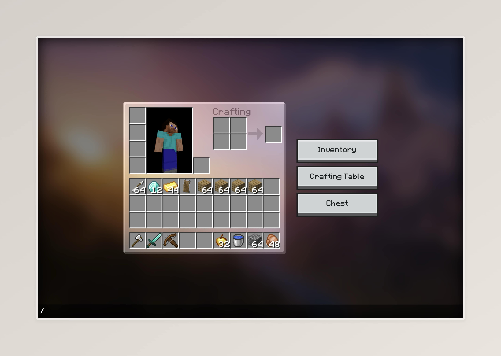

# Minecraft react crafting



Minecraft inventory and crafting, the same experience but in your browser. Inventory tricks works too. Made with React.

## Features

- Inventory (With rendered player character)
- Custom skins
- Items (v1.20)
- Crafting (v1.20)
- Click to get (L: get whole stack, R: get half stack)
- Click to place (L: place whole stack / switch item, R: place one item)
- Shift clicking (move items between inventories)
- Shift get all craftables
- Drag clicking (L: spread items, L: place one item)
- Number keys to swap items from hotbar (0-9)
- Commands (`/skin <name>` and `/give`)

## To-dos

- Double click with held item on same item type for moving between inventories
- Armor & shield slots
- Armor modelling
- Player skin outer layer

## Development

```bash
git clone https://github.com/EnhancedJax/minecraft-react-crafting.git
cd minecraft-react-crafting
npm install
npm start
```

### Generate items json

The merge script is used to merge the original textures.json by [TheDestruc7i0n](https://twitter.com/TheDestruc7i0n) with the items.json from Minecraft assets to generate the items.json used in the project.

```bash
node ./gen/merge.js
```

## Acknowledgements

[TheDestruc7i0n](https://twitter.com/TheDestruc7i0n) - original textures.json.
